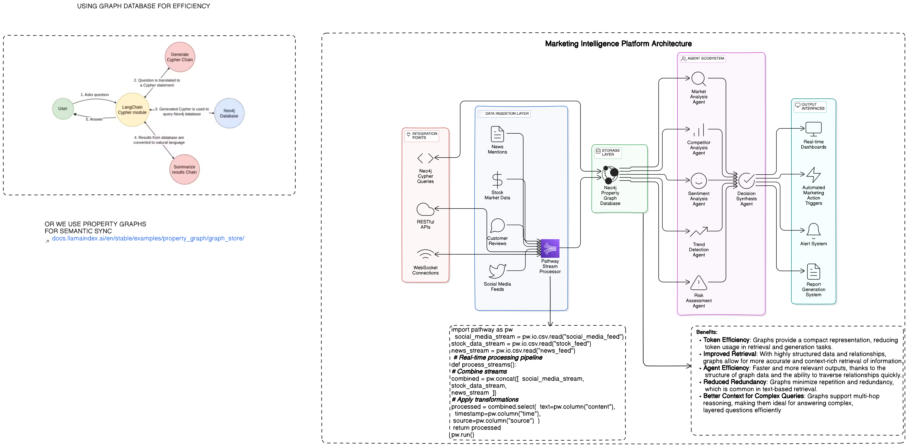

# AI_AgentXpathway_part2
# Smart Traffic Navigation System
Author: Bibhuti Jha .
I implemented Pathway data pipeline , and stroring it in neo4j graph database.
Here's the architecture-
## Architecture Overview

<div align="center">
  
</div>


## Installation

1. Clone the repository:
```bash
git clone <repository-url>
cd <directory>
```

2. Configure API keys in 'config/config.yaml'


### Docker Configuration

The system uses a multi-stage Docker build for optimization:


## Running the Application

### Using Docker Compose

```bash
docker-compose up --build
```

### Logs

View container logs:
```bash
docker logs <container-id>
```
### Still Stuck & Need Help?
📧 Contact: [jhabk369@gmail.com](mailto:jhabk369@gmail.com)

### Support
Having trouble? 
* Email me at [jhabk369@gmail.com](mailto:jhabk369@gmail.com)
* Create an issue in the repository

